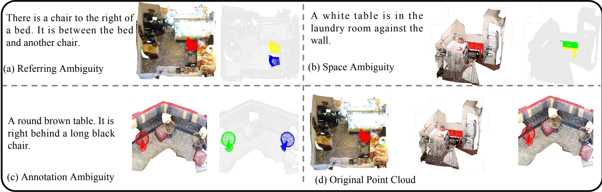
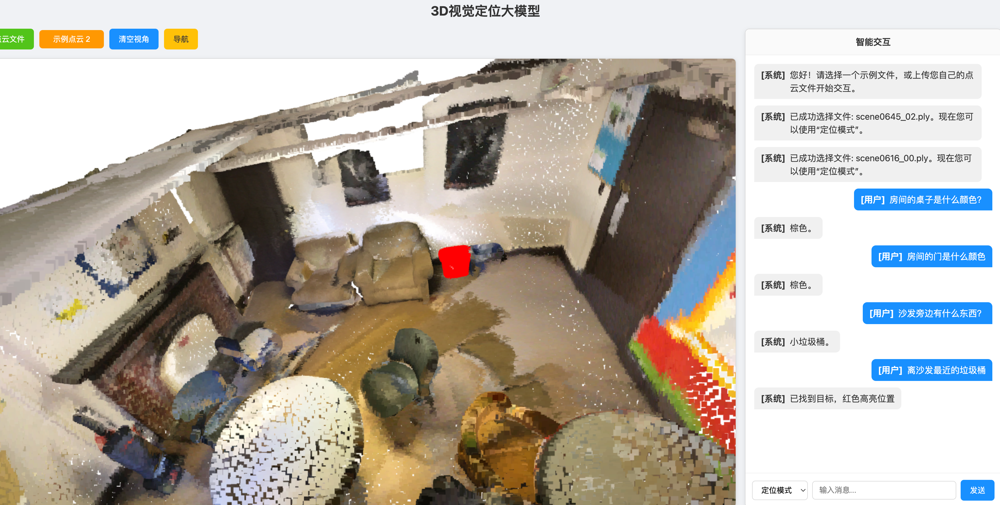

<div align="center">
<h1>3D-ATRES: Ambiguity-Tolerant Learning for 3D Referring Expression Segmentation</h1>

<a href=""></a>
<a href=''></a>
<a href="" target="_blank"></a>

[Jiangming Shi](xxx), [Chaoyang Li](), [Luosong Guo]()
</div>

## Overview
<div style="text-align: center;">
    
</div>
3D Referring Expression Segmentation (3D-RES) is an emerging yet challenging task at the interaction of vision and language, which aims to precisely segment a target instance within a 3D point cloud based on a given natural language referring expression. However, most previous methods overlook multi-source ambiguities that are prevalent in real-world scenarios, including prompt, spatial, and annotation ambiguities. Prompt ambiguity arises from confusion between referent and target objects due to ambiguous language, spatial ambiguity results from viewpoint variations causing incomplete segmentation, annotation ambiguity stems from inconsistent or noisy labeling in training data. In this paper, we propose a novel 3D Ambiguity-Tolerant Referring Expression Segmentation (3D-ATRES), which explicitly models and mitigates multi-source ambiguities in 3D-RES. Specifically, we employ $TR^2$ Semantic Structurizer to transform free-form natural language into structured Target–Relation–Referent triples, thereby eliminating referential ambiguity. For spatial ambiguity, we introduce a Normal‑Aware Spatial Alignment that leverages surface normal cues to achieve viewpoint-consistent geometry alignment. To combat annotation ambiguity, we incorporate a Annotation Ambiguity Penalty, enabling the network to learn from noisy or inconsistent annotations in a probabilistic manner. Experiments on ScanRefer and Multi3DRefer show that 3D-ATRES achieves state-of-the-art performance, confirming the effectiveness of modeling ambiguity in 3D-RES. Code will be released upon acceptance.

## Pretrained Model

We release several kinds of pretrained modelin HuggingFace webset. Their performance show in the next table. 

#### Dataset1
| **Pretrianed Model** | Index1 | Index2 | Index3|
|:----------------:|:-:|:-:|:-:|
| **Model 1**     | 0.04 | 0.05 | 0.07 |
| **Model 2**  | 1.88 | 2.07 | 2.45 |
| **Model 3**  | 1.88 | 2.07 | 2.45 |

#### Dataset2
| **Pretrianed Model** | Index1 | Index2 | Index3|
|:----------------:|:-:|:-:|:-:|
| **Model 1**     | 0.04 | 0.05 | 0.07 |
| **Model 2**  | 1.88 | 2.07 | 2.45 |
| **Model 3**  | 1.88 | 2.07 | 2.45 |

## Website Show

We make an [interactive website](http://521661fbe9494e65b3805ad5028c5cc1.cloud.lanyun.net:10000/) to let user try our model. Have a try now!

<div style="text-align: center;">
    
</div>

## Acknowledgements
Thanks to the following great repositories: [xxx](), [xxx](), [xxx]().

## Citation
```bibtex
@inproceedings{xxxx,
  title={3D-ATRES: Ambiguity-Tolerant Learning for 3D Referring Expression Segmentation},
  author={Shi, Jiangming and Li, Chaoyang and Guo, Luosong and},
  booktitle={xxxx},
  year={2025}
}
```
