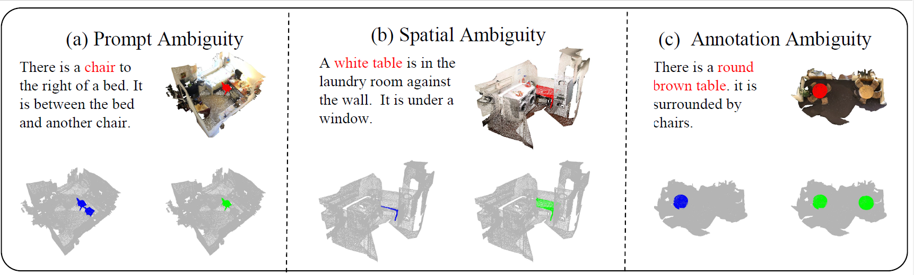

<div align="center">

# 🎯 3D-ATRES: Ambiguity-Tolerant Learning for 3D Referring Expression Segmentation


[Jiangming Shi](xxx), [Chaoyang Li](), [Luosong Guo]()

</div>

<div align="center">
  
  <p><em>3D-ATRES accurately segments target objects from ambiguous natural language descriptions</em></p>
</div>

## 🔍 Introduction

**3D-ATRES** is a groundbreaking framework that tackles one of the most challenging problems in 3D vision-language understanding: **3D Referring Expression Segmentation (3D-RES)**. Unlike existing methods that struggle with real-world ambiguities, our approach specifically addresses multi-source uncertainties through innovative ambiguity-tolerant learning mechanisms.

<div style="text-align: center;">
    
</div>

### 🎯 What Problem Do We Solve?

Real-world 3D referring expressions often suffer from three types of ambiguity:
- **Prompt Ambiguity**: Vague or underspecified language descriptions
- **Spatial Ambiguity**: Viewpoint-dependent spatial relationships  
- **Annotation Ambiguity**: Inconsistent or noisy training labels

3D-ATRES provides the first comprehensive solution to simultaneously handle all these challenges.

## ✨ Key Innovations

<div align="center">

| Feature | Innovation | Impact |
|---------|------------|--------|
| **🔄 TR² Semantic Structurizer** | Transforms free-form language into structured Target–Relation–Referent triples | Eliminates **prompt ambiguity** through semantic disambiguation |
| **🧭 Normal-Aware Spatial Alignment** | Incorporates surface normal cues for geometric reasoning | Ensures **viewpoint-invariant** spatial understanding |
| **📊 Annotation Ambiguity Penalty** | Probabilistic learning with ambiguity-aware loss functions | Robust to **inconsistent annotations** during training |

</div>

## 🏆 Performance Highlights

### State-of-the-Art Results on Major Benchmarks

<div align="center">

| Method | Venue | Base LLM | ScanRefer Acc@0.25 | ScanRefer Acc@0.5 | Multi3DRefer F1@0.25 | Multi3DRefer F1@0.5 |
|--------|-------|----------|-------------------|-------------------|----------------------|---------------------|
| 3D-LLM | NeurIPS'23 | BLIP2-flant5 | 30.3 | - | - | - |
| PQ3D | ECCV'24 | Vicuna-7B | 57.0 | 51.2 | - | - |
| ReGround3D | ECCV'24 | BLIP2-flant5 | 53.1 | 41.1 | - | - |
| Chat-Scene | NeurIPS'24 | Vicuna-7B | 55.5 | 50.2 | 57.1 | 52.4 |
| LIBA | AAAI'25 | - | 59.6 | 49.0 | - | 50.2 |
| Inst3D-LMM | CVPR'25 | Vicuna1.5-7B | 57.8 | 51.6 | 58.3 | 53.5 |
| Video-3D LLM | CVPR'25 | LLaVA-Video 7B | 58.1 | **51.7** | 58.0 | 52.7 |
| 3D-LLaVA | CVPR'25 | LLaVA-1.5-7B | 62.8 | 45.3 | 68.7 | 49.2 |
| **3D-ATRES (Ours)** | - | LLaVA-1.5-7B | **65.3** | 50.7 | **72.7** | **55.7** |

</div>

> 💡 **Key Insight**: Our method achieves particularly significant gains in challenging scenarios with complex spatial relationships and ambiguous descriptions, demonstrating superior ambiguity tolerance.

## 🌐 Live Demo

### Experience 3D-ATRES in Action

We provide an **[interactive online demo](http://521661fbe9494e65b3805ad5028c5cc1.cloud.lanyun.net:10000/)** where you can:

- 📤 Upload your own point clouds
- 💬 Test with custom referring expressions  
- 👁️ View real-time segmentation results
- 📊 Compare with baseline methods

### Demo Examples

#### Example 1: Complex Spatial Relationships
<div align="center">
    
</div>

#### Example 2: Ambiguous Object Descriptions  
<div align="center">
    
</div>

#### Example 3: Multi-Object Scenarios
<div align="center">
    
</div>

## 🗓️ Release Timeline

- [x] **Sept 2025**: Visualization tools released (`web2.4_EN/`)
- [ ] **Paper Received**: Training code and pretrained models
- [ ] **Paper Received**: Full documentation and tutorials
- [ ] **Paper Received**: Extended benchmarks and applications

## 🤝 Contributing

We welcome contributions from the community! Areas of interest include:

- 🔧 Performance optimizations  
- 📚 Additional documentation and tutorials
- 🌍 Multi-language support

*Contributing guidelines will be released with the code.*

## 📜 Citation

If you use 3D-ATRES in your research or find our work helpful, please cite our paper:

```bibtex
@inproceedings{shi20253datres,
  title = {3D-ATRES: Ambiguity-Tolerant Learning for 3D Referring Expression Segmentation},
  author = {Shi, Jiangming and Li, Chaoyang and Guo, Luosong and Gong,Jingyu and Zhang，Zhizhong and Xie， Yuan and Qu， Yanyun},
  booktitle = {},
  year = {2025},
  publisher = {xxxx}
}
